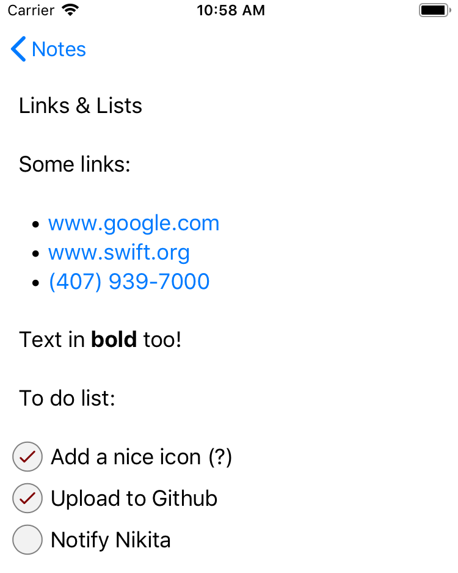

# Simple Notes

A simple Swift/iOS notes app with rich formatting based on TextKit APIs.

Rich formatting summary:

* Smart links for URLs and phone numbers
* Text formatting using `**bold**` and `*italic*` simple markup
* Support for *bullet*, *dashed*, and *ordered* lists (e.g., `* `, `- `, `1. `)
* Checkmark lists as well

## Main Classes ##

UI layer:

* [`NotesListViewController`][NotesListViewController.swift]. Displays all created noted in a table view.
* [`NoteEditorViewController`][NoteEditorViewController.swift]. View controller to show *and* edit a given note.
* [`NoteTextStorage`][NoteTextStorage.swift]. Stores a given note text with rich formatting. This implements the core text formatting engine.

Model layer:

* [`Note`][Note.swift]. The note model layer object. For simplicity, this is designed as a plain value type. The actual note contents is stored in *plain text*, following a simple Markdown-ish format.
* [`NotesManager`][NotesManager.swift]. Manages a list of notes model objects. This class centralizes with all communication with Firebase.

## Markdown-ish Encoding ##

The following richly formatted note:



is encoded as a Markdown-based plain text *string* (for database storage):

```
Links & Lists

Some links:

* www.google.com
* www.swift.org
* (407) 939-7000

Text in **bold** too!

To do list:

[x] Add a nice icon (?)
[x] Upload to Github
[_] Notify Nikita
```

[NotesListViewController.swift]: https://github.com/pmattos/Simple-Notes/blob/master/Simple%20Notes/NotesListViewController.swift#L71

[NoteEditorViewController.swift]: https://github.com/pmattos/Simple-Notes/blob/master/Simple%20Notes/NoteEditorViewController.swift#L11

[NoteTextStorage.swift]: https://github.com/pmattos/Simple-Notes/blob/master/Simple%20Notes/NoteTextStorage.swift#L11

[Note.swift]: https://github.com/pmattos/Simple-Notes/blob/master/Simple%20Notes/NotesManager.swift#L174

[NotesManager.swift]: https://github.com/pmattos/Simple-Notes/blob/master/Simple%20Notes/NotesManager.swift#L13
